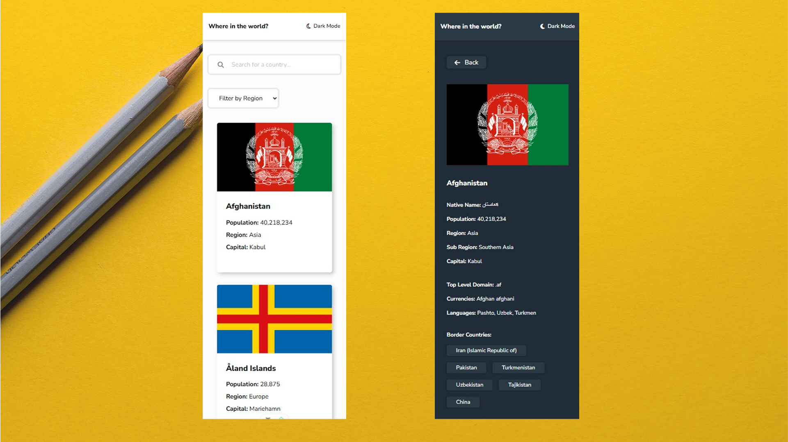

# REST Countries API with Theme Switcher - Vue 3 + Vite

This is my solution to the [Frontend Mentor - REST Countries API with color theme switcher challenge](https://www.frontendmentor.io/challenges/rest-countries-api-with-color-theme-switcher-5cacc469fec04111f7b848ca).  
The project is built with Vue 3 and Vite, and includes features like theme switching, region filtering, country search, and detailed views for each country.

## Demo & Repository

- **Live Site:** [https://angela0405.github.io/FM-REST-Countries-API/](https://angela0405.github.io/FM-REST-Countries-API/)
- **GitHub Repo:** [https://github.com/Angela0405/FM-REST-Countries-API](https://github.com/Angela0405/FM-REST-Countries-API)

## Screenshots

### Desktop (1920px)

### Mobile (375px)

## Features

- Light and dark mode toggle
- Filter countries by region (Asia, Europe, Africa, Americas, Oceania)
- Search countries by name
- Click a country to see more detailed information
- View bordering countries with navigation
- Data loaded from local `data.json` (simulated API)

## Built With

- **Vue 3** with `<script setup>` Composition API
- **Vite** for development and build
- **Vue Router** for page routing
- **Pinia** for global state (dark mode toggle)
- **Tailwind CSS** for utility-first styling and responsive design
- **Single File Components**: `Header.vue`, `CountryView.vue`, `CountryDetailView.vue`
- **Local JSON** used to simulate API data

## What I Learned

Working on this project helped me:

- Practice component-based architecture in Vue
- Use `fetch` to load and filter local JSON data
- Implement computed properties for search and filter logic
- Manage global state (theme mode) with Pinia
- Build multipage structure using Vue Router and dynamic routes
- Apply Tailwind for modern, dark-mode-enabled UI design

## Continued Development

Future improvements may include:

- Switching to a real API (like [REST Countries v3.1](https://restcountries.com/))
- Improving accessibility and keyboard navigation
- Adding component/unit tests
- Enhancing mobile experience and adding pull-to-refresh

## Acknowledgments

Thanks to Frontend Mentor for this engaging and visually rich challenge!  
It was a great opportunity to practice Vue 3, component architecture, state management, and responsive UI design.
